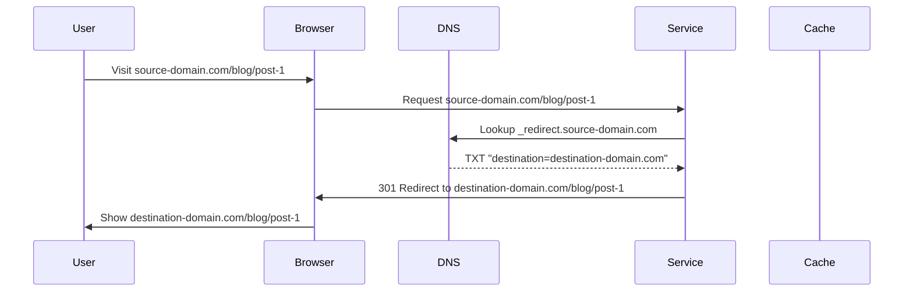
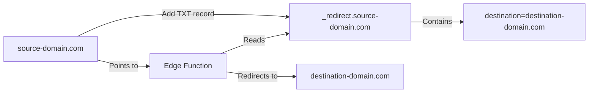

# Next.js DNS-Based Redirect Service

A lightweight domain redirection service that uses DNS TXT records to configure redirects. When someone visits your domain, the service checks for a special TXT record and redirects them to the destination domain while preserving the path and query parameters.

## How It Works

The service uses DNS TXT records to store redirect configurations. For each domain you want to redirect, you add a TXT record with a special prefix that specifies the destination domain.

### Flow Diagram



## Setup Instructions

### 1. Deploy the Edge Function

Deploy this service to a platform that supports Edge Functions (like Vercel):

```bash
# Deploy to Vercel
vercel deploy
```

### 2. Configure Your Domain

1. Point your domain (source-domain.com) to the deployed edge function on Vercel:
   ```dns
   # DNS Configuration for Vercel
   *.source-domain.com.      IN    CNAME    cname.vercel-dns.com.
   ```

2. Add the TXT record for redirection:
   ```dns
   _redirect.source-domain.com.    IN    TXT    "destination=destination-domain.com"
   ```

3. Verify domain ownership in Vercel dashboard:
   ```dns
   _vercel.source-domain.com.    IN    TXT    "{verification-code}"
   ```

### Example Flow

```plaintext
Setup:
1. You want to redirect: source-domain.com → destination-domain.com
2. Deploy this edge function and point source-domain.com to it
3. Add a TXT record to source-domain.com's DNS:
   _redirect.source-domain.com  TXT  "destination=destination-domain.com"

Redirect Process:
1. User visits: source-domain.com/blog/post-1?id=123
2. Service reads TXT record: _redirect.source-domain.com
3. Finds destination: destination-domain.com
4. Redirects to: destination-domain.com/blog/post-1?id=123
   - Preserves the entire path (/blog/post-1)
   - Preserves all query parameters (?id=123)
   - Uses 301 (permanent) redirect
```

### DNS Configuration



### Features

- 🎯 Redirects entire domains using DNS configuration
- 🛣️ Preserves all URL paths and query parameters
- 🔄 301 permanent redirects for better SEO
- 🌐 Works with any DNS provider
- ⚡ Fast middleware-based routing
- 🌍 Edge function deployment for global performance

### Supported Platforms

- ▲ Vercel
- 👷 Cloudflare Workers
- 🔥 Firebase Hosting
- Any platform supporting Edge Functions/Middleware